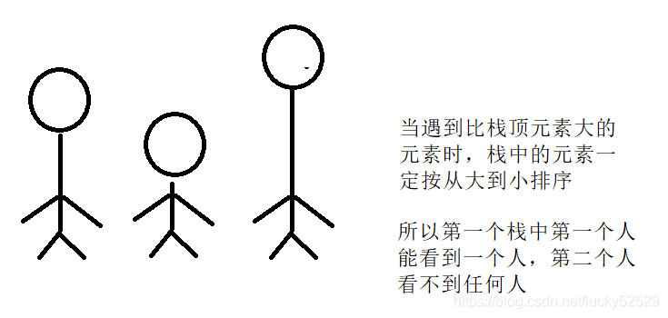

# 单调栈

## 原理

单调栈中存放的数据应该是有序的，所以单调栈也分为单调递增栈和单调递减栈。以单调递减栈为例，若当前元素小于栈顶元素，则入栈；若大于栈顶元素，则栈顶元素出栈，继续比较至当前元素入栈。

```C
stack<int> st;
for(遍历这个数组) {
	if (栈空 || 栈顶元素大于等于当前比较元素) {
		入栈;
	}
	else {
		while (栈不为空 && 栈顶元素小于当前元素) {
			栈顶元素出栈;
			更新结果;
		}
		当前数据入栈;
	}
}
```

## 应用

### 视野总和

有n个人站队，所有的人全部向右看，个子高的可以看到个子低的发型，给出每个人的身高，问所有人能看到其他人发现总和是多少？

输入：4 3 7 1
输出：2
解释：个子为4的可以看到个子为3的发型，个子为7可以看到个子为1的身高，所以1+1=2
思路：观察题之后，我们发现实际上题目转化为找当前数字向右查找的第一个大于他的数字之间有多少个数字，然后将每个结果累计就是答案，但是这里时间复杂度为O(N^2)，所以我们使用单调栈来解决这个问题

<center>

</center>

```C
int FieldSum(vector<int>& v) {
    v.push_back(INT_MAX);/这里可以理解为需要一个无限高的人挡住栈中的人，不然栈中元素最后无法完全出栈
    stack<int> st;
    int sum = 0;
    for (int i = 0; i < (int)v.size(); i++) {
        if (st.empty() || v[st.top()] > v[i]) { //小于栈顶元素入栈 
            st.push(i);
        }
        else {
            while (!st.empty() && v[st.top()] <= v[i]) {
                int top = st.top(); //取出栈顶元素
                st.pop();
                sum += (i - top - 1); //这里需要多减一个1
            }
            st.push(i);
        }
    }
    return sum;
}
```

## 参考资料

> [数据结构——单调栈](https://blog.csdn.net/lucky52529/article/details/89155694)
